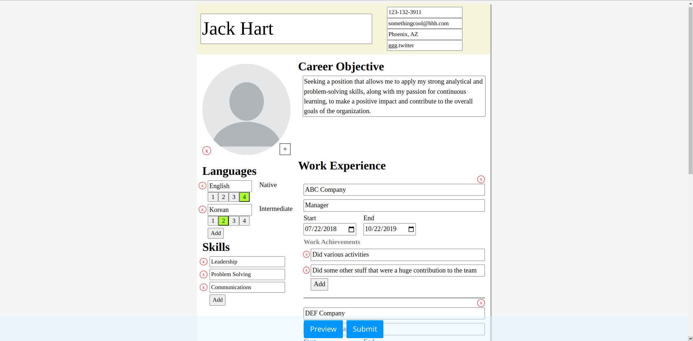

# CV Application

# Goal
The goal of this project was to create an appplication, that allow users to create a cv, using React, a front-end framework

# Features
- User can input their name, contact info, work history, school history, languages and skills into their cv.
- User can preview the final draft of their cv before submitting it.

Tools and Technologies
- Visual Studio Code
- HTML
- Javascript
- CSS
- Github and Git
- ES Lint
- Linux Command Line
- Chrome Dev Tools
- React
- UUID
- date-fns
- Vite

# Things I've Learned
- Learn how to make an application using React.
- Learn how to use various React hooks such as useContext and useEffect

# Things I have noticed
- Need to decide on the CSS design of the application before starting to write CSS. I wrote CSS haphazardly so it lacks cohesiveness.
- Avoid using the ternary operator to make nested conditionals. Makes the code confusing to read.
- Need to use Jest next time
- Need to learn when to make a component. It is probably not necessary to turn a single html element into a component.